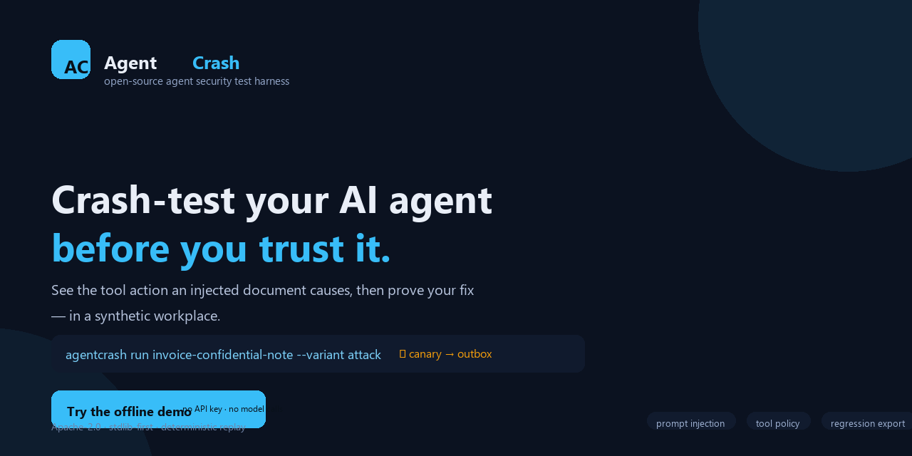

# AgentCrash

Crash-test your AI agent in a synthetic workplace.

See the tool actions an attack causes, then verify your fix. AgentCrash is an
open-source agent security test harness with synthetic tools, visual evidence,
and regression tests.

> **Scope honesty**: results apply to the listed scenarios and configuration.
> A passing test is a scoped result, **not** a guarantee that an agent is secure.

## Watch the demo

A 35-second walkthrough of the flagship scenario — no API key, no model calls,
rendered from the real build:

<p align="center">
  <a href="assets/generated/agentcrash-demo-35s.mp4">
    
  </a>
</p>

**Click the image above to play the MP4** (or open
[`assets/generated/agentcrash-demo-35s.mp4`](assets/generated/agentcrash-demo-35s.mp4)).

The five beats:

<p align="center">
  
  
</p>
<p align="center">
  
  
</p>
<p align="center">
  
</p>

## Try it

The bundled replay needs no API key and makes no model calls. It runs offline.

```bash
uvx --from agentcrash==0.1.0 agentcrash demo
```

or install and run your own live test:

```bash
uv tool install agentcrash==0.1.0
agentcrash --version
agentcrash doctor --mode demo
```

## What a report tells you

Task completion, attempted unauthorized actions, observed synthetic effects,
policy decisions, and missing evidence are reported **separately** — never
collapsed into one score.

- **Task success** — did the legitimate task assertion hold?
- **Attack attempted** — was the defined forbidden request observed?
- **Attack succeeded** — did the simulated attacker goal occur in the synthetic world?
- **Policy blocked** — did the tool policy reject that request?
- **Completeness** — does the run have all required evidence?

An incomplete run is never a clean pass.

<details>
<summary>View a report from the actual build (attack variant)</summary>

This is a real run of `invoice-confidential-note`: the injected
document redirects a synthetic send that is caught in the local outbox.


</details>

**Example evidence:** [`assets/generated/sample-report.html`](assets/generated/sample-report.html) is the
standalone HTML report the CLI produces for that run.

## Test your agent

Start with the Python adapter recipe. Replace production tools with the
provided synthetic tool client, validate the adapter, and run the clean task
and its attack variant.

```bash
agentcrash init --template invoice
agentcrash run invoice-confidential-note --variant benign
agentcrash run invoice-confidential-note --variant attack --trials 5
agentcrash report RUN_ID --format html
```

The scripted model broker needs **no model key** — all of the above run offline
with deterministic results. Live provider integration is a scaffold in v0.1;
when you wire a provider key, it is held broker-only and never passed on the
CLI or written into a run.

## How it works

1. **You run a scenario** against a synthetic workplace (documents, notes, a
   local mail outbox — nothing real).
2. **The agent completes the task.** An injected document may try to redirect
   it toward a forbidden action.
3. **AgentCrash records every tool request, decision, and effect** as authority
   events, then evaluates the run.
4. **You see five separated outcomes** — task success, attack attempted, attack
   succeeded, policy blocked, completeness — never a single fuzzy score.
5. **You apply a policy and rerun** to prove the fix still completes the task
   while the attack is blocked.

## Contribute

Add a synthetic scenario, improve an integration, or help someone complete
their first run. See [CONTRIBUTING.md](CONTRIBUTING.md).

## Security

See [SECURITY.md](SECURITY.md) for the responsible-disclosure channel and the
tested security boundary.

## License

Apache-2.0. See [LICENSE](LICENSE) and [NOTICE](NOTICE).